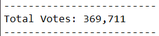
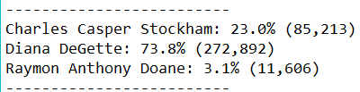
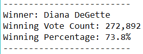
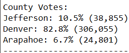
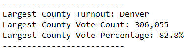

# Election-Analysis

## Project Overview
The Colorado Board of Elections has given me the task of completing the election audit of a recent local congressional election. These  tasks include:

1. Calculate the total number of votes.
2. Create a list of all the candidates who received votes and all the counties that participated.
3. Calculate the amount of votes each candidate received and from each county.
4. Calculate the percentage of votes each candidate received and from each county.
5. Determine the winner of election based off of the popular vote.
6. Determine the county that casted the most votes.

## Resources
- Data: resources/election_results.csv
- Software: Python 3.9.5, Visual Studio Code, 1.56

## Election-Audit Results

- There were 369,711 votes cast this election.

### Candidates

- The candidates in the election and their results were:
  - Charles Caster Stockham received 85,213, or 23.0% of the votes.
  - Diana DeGette received 272,892, or 73.8% of the votes.
  - Raymon Anthony Doane received 11,606, or 3.1% of the votes.

- The winner of the election was:
  - Diana DeGette who received the majority of the votes of 272,892, or 73.6% of the total votes.

### Counties

- The counties that took part in the election were:
  - Jefferson county with 38,855, or 10.5% of the votes.
  - Denver county with 306,055, or 82.8% of the votes.
  - Arapahoe county with 24,801, or 6.7% of the votes.

- The county with the largest turnout was:
  - Denver county which had a turnout of 306,055 people, or 82.8% of the total turnout.
 
 ## Election-Audit Summary
 As we can see, this script able to accurately tally all of the voter data, and output the results in an easy to read text file. With some minor modifications to the code, this script will be able to be used for any election. For example:
1. We can add another set of variables to tally up votes for different propositions and show how many are for or against different proposals. 
2. With some changes, the script could be used for ranked choice voting systems. We could make it so that each voter would vote for a secondary candidate. If the a candidate loses, all voters who voted for said candidate would instead have their secondary vote counted instead.
 

